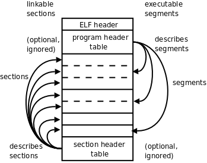

LAB1
====================

Installing gcc in Mac OS X
---------------------
Use brew to install glib, gmp, mpfr, libmpc before configuring gcc:
```shell
brew install glib
brew install gmp
brew install mpfr
brew install libmpc
```

Build gcc outside of the source tree:
```shell
mkdir build 
cd build
../configure --target=i386-jos-elf --disable-nls --without-headers --with-newlib --disable-threads --disable-shared --disable-libmudflap --disable-libssp
```

Installing qemu 
---

```shell
./configure --target-list="i386-softmmu" --disable-kvm --disable-sdl
make
make install
```

Configuring JOS
---
Append the following line to `conf/env.mk`: 
```
QEMU=/usr/local/bin/qemu-system-x86_64
```

Then type `make` and `make qemu`

Struggling with gdb
---
Type `gdb` then `boot` is loaded but `kernel` can't be recognized

```shell
>> gdb
.gdbinit:30: Error in sourced command file:
"lab/obj/kern/kernel": can't read symbols: File format not recognized.
```

Check the `.gdbinit` and get:
> If this fails, it's probably because your GDB doesn't support ELF.
> Look at the tools page at
>  http://pdos.csail.mit.edu/6.828/2009/tools.html
> for instructions on building GDB with ELF support.

Goto `/usr/local/bin` and find `i386-jos-elf-gdb` 
Use `i386-jos-elf-gdb` rather than `gdb`:

```shell
  Clann$ i386-jos-elf-gdb
GNU gdb 6.8
Copyright (C) 2008 Free Software Foundation, Inc.
License GPLv3+: GNU GPL version 3 or later <http://gnu.org/licenses/gpl.html>
This is free software: you are free to change and redistribute it.
There is NO WARRANTY, to the extent permitted by law.  Type "show copying"
and "show warranty" for details.
This GDB was configured as "--host=i386-apple-darwin12.4.0 --target=i386-jos-elf".
+ target remote localhost:25501
[New Thread 1]
The target architecture is assumed to be i386
0xf01004c0: push   %ebp
0xf01004c0 in ?? ()
+ symbol-file obj/kern/kernel
(gdb) 
```
Exercise 3
---

>Q: At what point does the processor start executing 32-bit code? What exactly causes the switch from 16- to 32-bit mode?

The `movl %eax, %cr0` causes the switch from 16- to 32-bit mode in the `boot.S`:
```assembly
  lgdt    gdtdesc
  movl    %cr0, %eax
  orl     $CR0_PE_ON, %eax
  movl    %eax, %cr0
  ljmp    $PROT_MODE_CSEG, $protcseg
```


>Q: What is the last instruction of the boot loader executed, and what is the first instruction of the kernel it just loaded?

In `main.c`, it's
```c
  ((void (*)(void)) (ELFHDR->e_entry))();
```
In `boot.asm`, it's
```asm
    7d63: ff 15 18 00 01 00     call   *0x10018
```

>Q: Where is the first instruction of the kernel?

Since the last instruction the boot loader executed is 
`call *0x10018`, the first instruction of the kernel should be at `0x10018`.


>Q: How does the boot loader decide how many sectors it must read in order to fetch the entire kernel from disk? Where does it find this information?

The boot loader reads the number the `pragram header`s in the `ELF header` and loads them all:
```c
  ph = (struct Proghdr *) ((uint8_t *) ELFHDR + ELFHDR->e_phoff);
  eph = ph + ELFHDR->e_phnum;
  for (; ph < eph; ph++)
    readseg(ph->p_pa, ph->p_memsz, ph->p_offset);
```


Exercise 5. 
---

So what's the difference between link address and load address?
See [Linking vs loading](http://www.iecc.com/linker/linker01.html).

>Q: Trace through the first few instructions of the boot loader again and identify the first instruction that would "break" or otherwise do the wrong thing if you were to get the boot loader's link address wrong. 

Obviously the `ljmp    $PROT_MODE_CSEG, $protcseg` is the first instruction that breaks:
```asm
Right:
[   0:7c2d] 0x7c2d: ljmp   $0x8,$0x7c32
The target architecture is assumed to be i386
0x7c32: mov    $0x10,%ax
0x7c36: mov    %eax,%ds
0x7c38: mov    %eax,%es
0x7c3a: mov    %eax,%fs
```   
```asm
Wrong:
[   0:7c2d] 0x7c2d: ljmp   $0x8,$0x7c36
[f000:e05b] 0xfe05b:  cmpl   $0x0,%cs:0x66d4
[f000:e062] 0xfe062:  jne    0xfd3da
[f000:d3da] 0xfd3da:  cli    
[f000:d3db] 0xfd3db:  cld 
```

Exercise 6
---

>Q: Examine the 8 words of memory at 0x00100000 at the point the BIOS enters the boot loader

They are all zeros.

>Q: and then again at the point the boot loader enters the kernel

They are the first few fields of an `elf header`:
```c
struct Elf {
  uint32_t e_magic; // must equal ELF_MAGIC
  uint8_t e_elf[12];
  uint16_t e_type;
  uint16_t e_machine;
  uint32_t e_version;
  uint32_t e_entry;
  uint32_t e_phoff;
  uint32_t e_shoff;
  uint32_t e_flags;
  uint16_t e_ehsize;
  uint16_t e_phentsize;
  uint16_t e_phnum;
  uint16_t e_shentsize;
  uint16_t e_shnum;
  uint16_t e_shstrndx;
};
```
```
(gdb) x/8w 0x10000
0x10000:  0x464c457f  0x00010101  0x00000000  0x00000000
0x10010:  0x00030002  0x00000001  0x0010000c  0x00000034
```

Exercise 7
---
>Q: Use QEMU and GDB to trace into the JOS kernel and stop at the movl %eax, %cr0. Examine memory at 0x00100000 and at 0xf0100000. Now, single step over that instruction using the stepi GDB command. Again, examine memory at 0x00100000 and at 0xf0100000. Make sure you understand what just happened.

Paging enabled:
```
(gdb) 
0x100025: mov    %eax,%cr0
0x00100025 in ?? ()
(gdb) x/8w 0x00100000
0x100000: 0x1badb002  0x00000000  0xe4524ffe  0x7205c766
0x100010: 0x34000004  0x6000b812  0x220f0011  0xc0200fd8
(gdb) x/8w 0xf0100000
0xf0100000 <_start+4026531828>: 0xffffffff  0xffffffff  0xffffffff0xffffffff
0xf0100010 <entry+4>: 0xffffffff  0xffffffff  0xffffffff  0xffffffff
(gdb) si
0x100028: mov    $0xf010002f,%eax
0x00100028 in ?? ()
(gdb) x/8w 0x00100000
0x100000: 0x1badb002  0x00000000  0xe4524ffe  0x7205c766
0x100010: 0x34000004  0x6000b812  0x220f0011  0xc0200fd8
(gdb) x/8w 0xf0100000
0xf0100000 <_start+4026531828>: 0x1badb002  0x00000000  0xe4524ffe  0x7205c766
0xf0100010 <entry+4>: 0x34000004  0x6000b812  0x220f0011  0xc0200fd8
```

>Q: What is the first instruction after the new mapping is established that would fail to work properly if the mapping weren't in place? 

`jmp *%eax` would fail because `0xf010002c` is outside of RAM
```shell
  movl  %eax, %cr3
  # Turn on paging.
  movl  %cr0, %eax
  orl $(CR0_PE|CR0_PG|CR0_WP), %eax
  # movl  %eax, %cr0

  # Now paging is enabled, but we're still running at a low EIP
  # (why is this okay?).  Jump up above KERNBASE before entering
  # C code.
  mov $relocated, %eax
  jmp *%eax
relocated:

  # Clear the frame pointer register (EBP)
  # so that once we get into debugging C code,
  # stack backtraces will be terminated properly.
  movl  $0x0,%ebp     # nuke frame pointer
```
```
qemu: fatal: Trying to execute code outside RAM or ROM at 0x00000000f010002c
```


